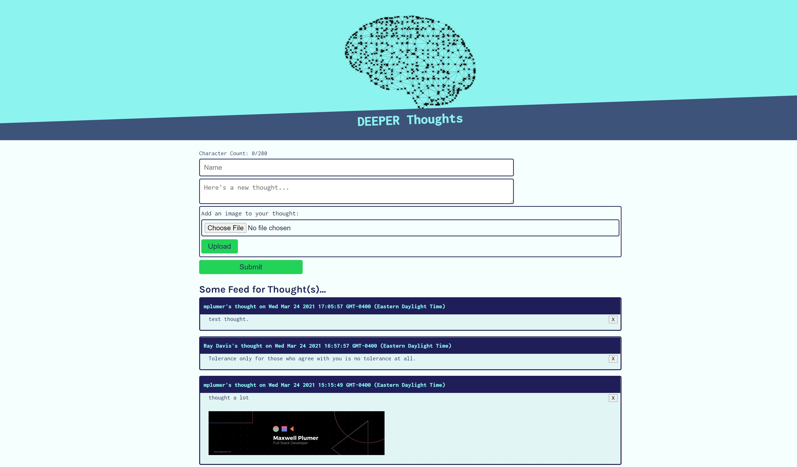
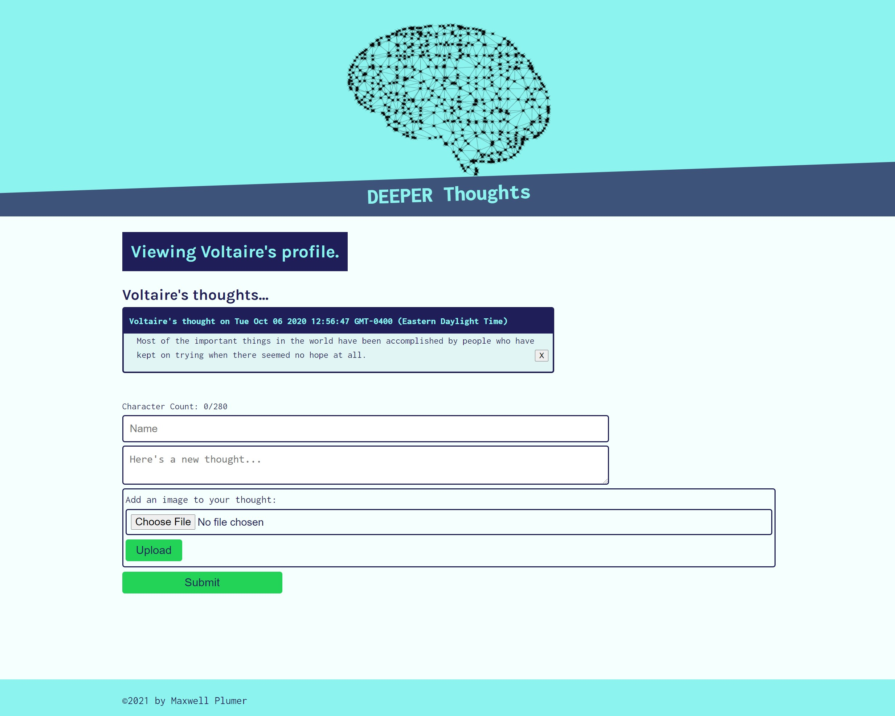
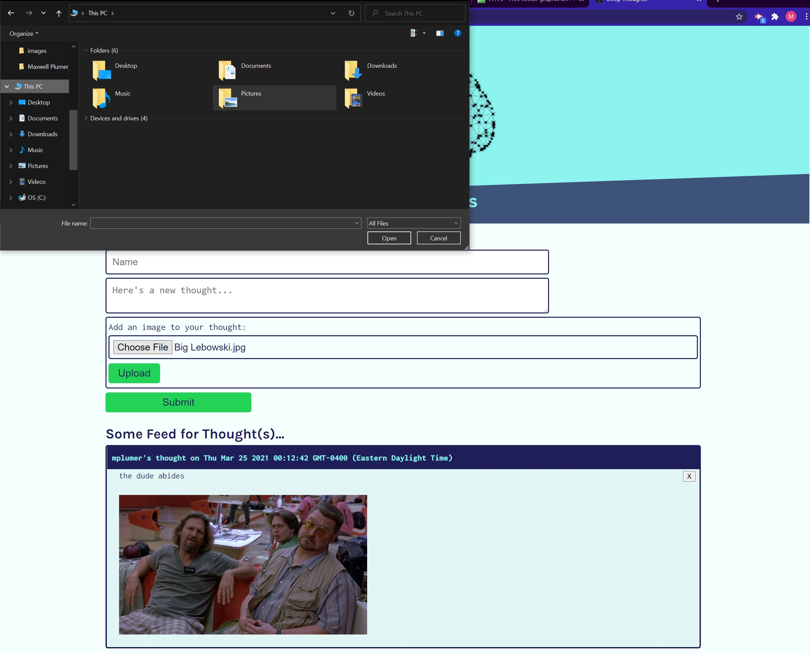

# Deeper Thought

## Table of Contents

- [Deeper Thought](#deeper-thought)
  - [Table of Contents](#table-of-contents)
  - [Description](#description)
  - [GitHub Repo and Heroku Deployment](#github-repo-and-heroku-deployment)
  - [Screenshots](#screenshots)
  - [Technologies](#technologies)
  - [Installation](#installation)
  - [Usage](#usage)
  - [Credits](#credits)

## Description

The goal for this project was to implement some of the services offered by AWS to an existing app where users are able to post thoughts. The app utilizes a React front-end and a Node.js, Express, and DynamoDB back-end. The app uses an S3 bucket to store pictures, a DynamoDB to store all other data, and is hosted on an EC2 instance.

## GitHub Repo and Heroku Deployment

[GitHub Repo](https://github.com/mplumer/deeper-thought)

[EC2 Deployment](coming soon)

## Screenshots

## Technologies

Please see the following for a list of technologies used in this project:

- JavaScript
- Git Bash
- Git
- Express
- React
- Node.js
- DynamoDB
- S3
- EC2

## Installation

To view on a local machine, pull the code from my GitHub using Git (or Terminal) and use the following (or similar) programs:

Operating System: Windows_NT x64 10.0.18363
Visual Studio Code: 1.48.2
Google Chrome: 78.0.3904.130
Git for Windows: 2.28.0.1

[Express](https://expressjs.com)

[React](https://reactjs.org)

[Node.js](https://nodejs.org/en)

[DynamoDB](https://aws.amazon.com/dynamodb)

[S3](https://aws.amazon.com/s3)

[EC2](https://aws.amazon.com/ec2)

Git clone link: https://github.com/mplumer/deeper-thought.git

## Usage

To run this application on a local machine, make sure all of the programs (or similar) listed in [Installation](#Installation) are installed. Clone the repo using the above Git clone link. Navigate to the local repository on your machine where you've cloned it using Git Bash/Terminal and in the directory containing the README.md. Make sure to install any dependencies using "npm i" (reference the included package.json file). Then use "npm start" to run the app!

## Credits

This was a continuation course completed as part of the Vanderbilt University Coding Boot Camp.